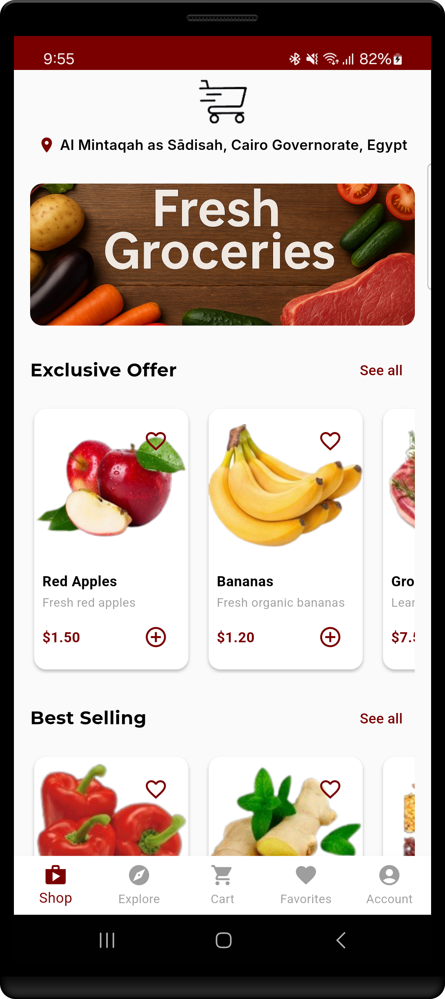
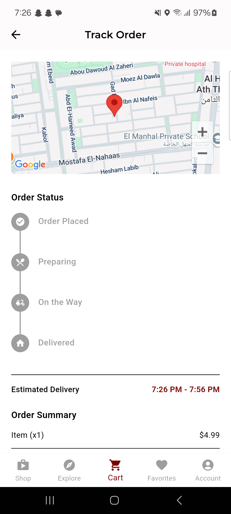

# 🛒 SOUQÉ – Smart Grocery Shopping App

A new Flutter project.
SOUQÉ is a cross-platform grocery shopping mobile application developed with Flutter. It offers an intelligent shopping experience with features like personalized recommendations, allergy alerts, cart and order tracking, and Firebase integration for authentication and data storage.

## 📲 Features

- 📦 **Product Browsing**: Explore categories, exclusive deals, and popular items.
- ⚠️ **Allergy Warnings**: Alerts for ingredients matching user medical profiles.
- 🗺️ **Order Tracking**: Google Maps integration for delivery tracking.
- 🔐 **Authentication**: Login via phone, email/password, and Google.
- ☁️ **Cloud Firestore**: Secure, scalable backend for users, orders, and products.
- ❤️ **Favorites**: Save and access favorite products.
- 🎨 **Modern UI**: Beautiful design using Montserrat and Inter fonts.

## Getting Started

### Prerequisites

- Flutter 3.x+
- Firebase project (setup auth & Firestore)
- Google Maps API key

### Installation

```bash
git clone https://github.com/your-username/souqe-app.git
cd souqe-app
flutter pub get
```

### Firebase Setup

1. Create a Firebase project.
2. Add Android/iOS apps.
3. Replace `google-services.json` / `GoogleService-Info.plist`.
4. Enable **Authentication** (Email, Phone, Google).
5. Set **Firestore Rules** (see below).

## 🔒 Firestore Rules

```js
service cloud.firestore {
  match /databases/{database}/documents {
    match /users/{userId} {
      allow create, update: if request.auth != null && request.auth.uid == userId;
      allow read, delete: if request.auth != null && request.auth.uid == userId;
    }

    match /products/{productId}, /categories/{categoryId} {
      allow read: if true;
      allow write: if false;
    }

    match /carts/{cartId} {
      allow create: if request.auth != null &&
                    request.resource.data.userId == request.auth.uid;
      allow read, update, delete: if request.auth != null &&
                                  request.auth.uid == resource.data.userId;
    }

    match /orders/{orderId} {
      allow create: if request.auth != null &&
                    request.resource.data.userID == request.auth.uid;
      allow read, update: if request.auth != null &&
                          request.auth.uid == resource.data.userID;
      allow delete: if false;
    }
  }
}
```

## 📷 Screenshots
### 🏠 Home Screen & 🗺️ Order Tracking

 

- more screenshots in folder  `Screenshots`

### Recorded Video
[🎬 Watch Demo Video](https://github.com/NourhanFarag/SouqeApp/blob/main/appScreenRecorded.mp4)

## 👩‍💻 Team 
-Malak Mounir Abdellatef 
-Nourhan Farag Mohamed 
-Farida Waheed Abdelbary 
-Nour Hesham Elsayed 
